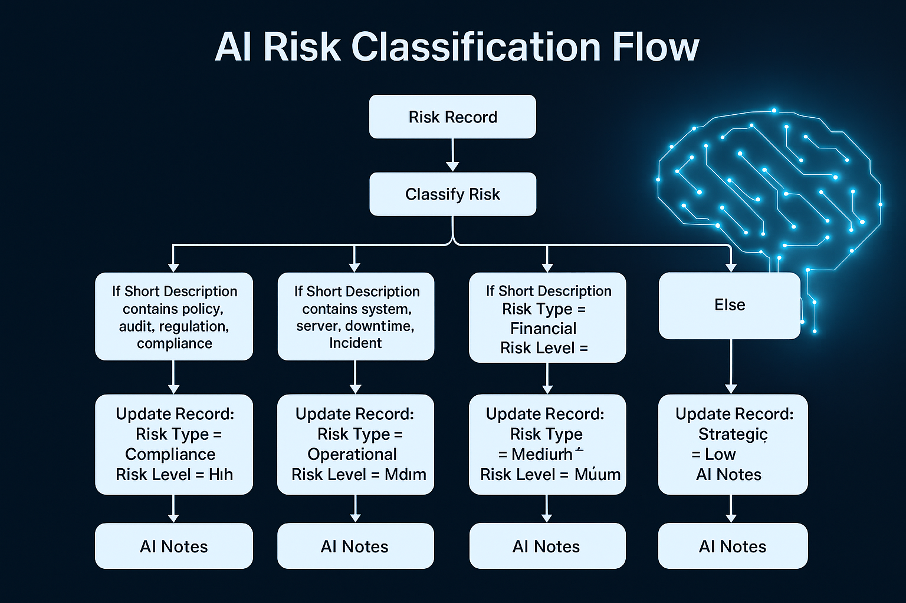

# ServiceNow_GRC_Project1
# ServiceNow GRC | AI Risk Classification Flow (Yokohama PDI)

## Overview
This project demonstrates an **AI-driven Risk Classification Flow** built in ServiceNow using **Flow Designer** on the **Yokohama PDI**.  
The automation simulates an AI system that analyzes a Risk record’s description and intelligently classifies it as **Compliance**, **Operational**, **Financial**, or **Strategic**, while assigning an appropriate **Risk Level** and generating **AI reasoning notes**.

---

## Flow Logic
1. **Trigger:** Risk Record created or updated  
2. **If (Compliance keywords):**  
   - Detected terms: *policy, audit, regulation, compliance*  
   - → **Risk Type:** Compliance  
   - → **Risk Level:** High  
   - → **AI Notes:** “AI detected compliance-related terms such as policy or regulation.”  
3. **Else If (Operational keywords):**  
   - Detected terms: *system, downtime, server, incident*  
   - → **Risk Type:** Operational  
   - → **Risk Level:** Medium  
   - → **AI Notes:** “AI detected operational risk keywords.”  
4. **Else If (Financial keywords):**  
   - Detected terms: *budget, loss, cost*  
   - → **Risk Type:** Financial  
   - → **Risk Level:** Medium  
   - → **AI Notes:** “AI detected financial indicators such as cost or loss.”  
5. **Else (Default):**  
   - → **Risk Type:** Strategic  
   - → **Risk Level:** Low  
   - → **AI Notes:** “No match found. Defaulted to strategic risk category.”  

---

## Highlights
- Built using **Flow Designer** on **Yokohama PDI**
- Demonstrates **AI reasoning** and **risk automation**
- Fully **no-code** implementation
- Transparent decision logic with **AI Notes**  
- Ideal for **GRC automation portfolios**

---

## Diagram

---

## Example Results
| Short Description | Risk Type | Risk Level | AI Notes |
|--------------------|------------|-------------|-----------|
| “Audit policy not followed” | Compliance | High | Compliance terms detected |
| “Server downtime risk” | Operational | Medium | Operational issue detected |
| “Budget overrun due to project delay” | Financial | Medium | Financial indicator detected |
| “Unclear business direction” | Strategic | Low | Default fallback |

## Business Impact
This project showcases how **AI automation** can enhance Governance, Risk & Compliance (GRC) efficiency by:
- Reducing manual classification errors  
- Prioritizing high-risk compliance items  
- Providing auditable AI reasoning for decision-making  
- Building a foundation for **Predictive Risk Intelligence**
